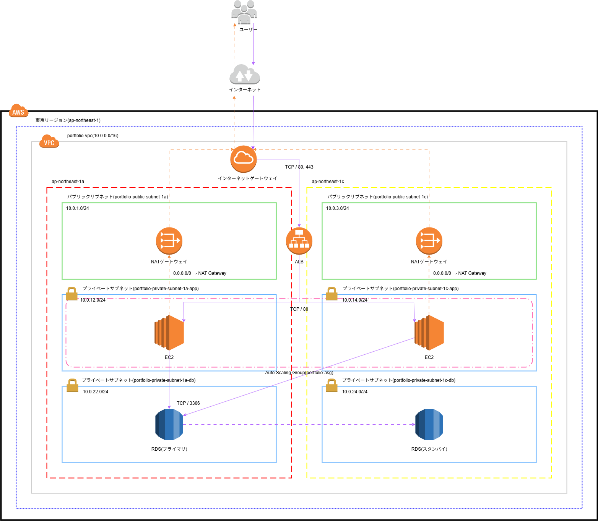

# AWS 3層構成ポートフォリオ環境（Terraform）

## プロジェクト概要

Terraformを用いて AWS 上に ALB + ASG + EC2 + RDS 構成のインフラを構築するポートフォリオです。
冗長構成・スケーラビリティ・設計力を意識し、IaC による本番環境に近い3層構成を再現しています。


## 目的

- TerraformによるIaCスキルの証明
- 冗長構成（Multi-AZ）・スケーラブルな設計の理解
- AWSネットワーク・セキュリティ設計力の実演
- ポートフォリオを通じた転職・業務スキルの可視化
- 本構成は学習・ポートフォリオ目的で構築しており、再利用性や拡張性を高めるためのモジュール化・変数化は今後の改善対象としています

## 構成サービス

| 層            | 使用サービス                                                |
|---------------|-------------------------------------------------------------|
| ネットワーク  | VPC, Subnet（Public/App/DB）, IGW, NAT Gateway, Route Table |
| WEB/API層     | ALB, Auto Scaling Group, EC2（Amazon Linux）                |
| データベース層| RDS（MySQL）                                                |
| セキュリティ  | Security Group, Bastion EC2                                 |
| IaC           | Terraform（v1.8.0以上 / AWS provider ~> 5.0）               |


## アーキテクチャ概要

[](./13_構成図_portfolio.drawio.png)

[構成図（.drawioファイル）を開く](./14_構成図_portfolio.drawio)

- リージョン：ap-northeast-1（東京）
- Availability Zones：1a / 1c
- CIDR設計：10飛ばし、Public = 奇数, Private = 偶数, 1スタート
- 命名規則：`portfolio-リソース種別-用途`


## ファイル構成
```
.
├── 00_README.md
├── 01_main.tf（プロバイダ設定）
├── 02_vpc.tf
├── 03_subnet.tf
├── 04_internet_gateway.tf
├── 05_nat_gateway.tf
├── 06_route_table.tf
├── 07_security_group.tf
├── 08_asg_ec2.tf
├── 09_rds.tf
├── 10_alb.tf
├── 11_bastion.tf
├── 12_基本設計書.xlsx
└── 13_構成図.drawio
```

#  使用方法（ローカル環境）

```bash
terraform init
terraform plan
terraform apply
```